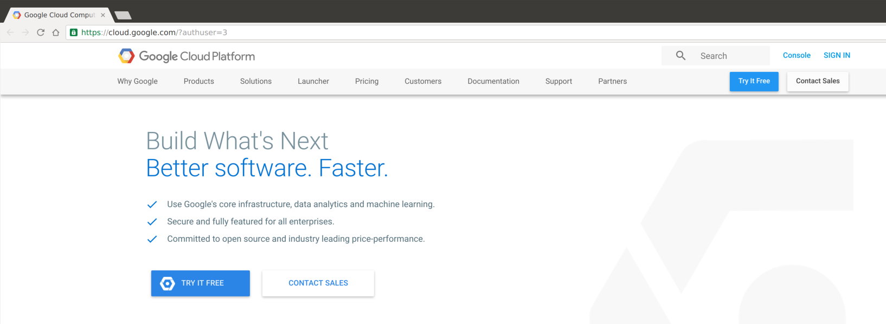
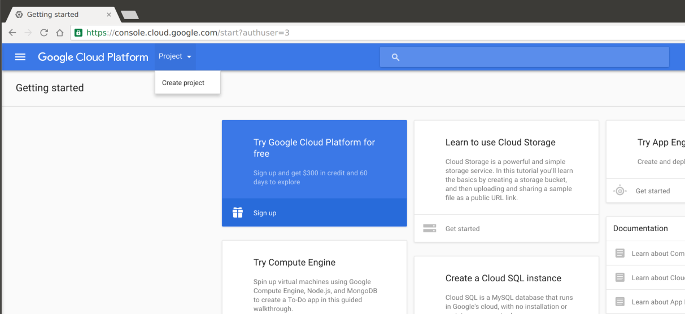
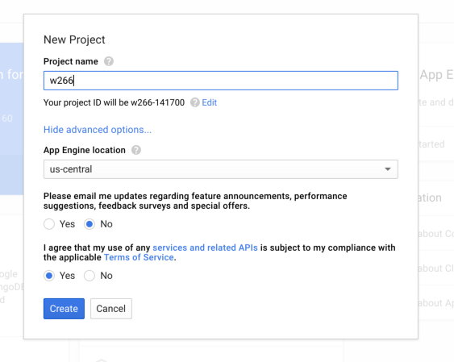
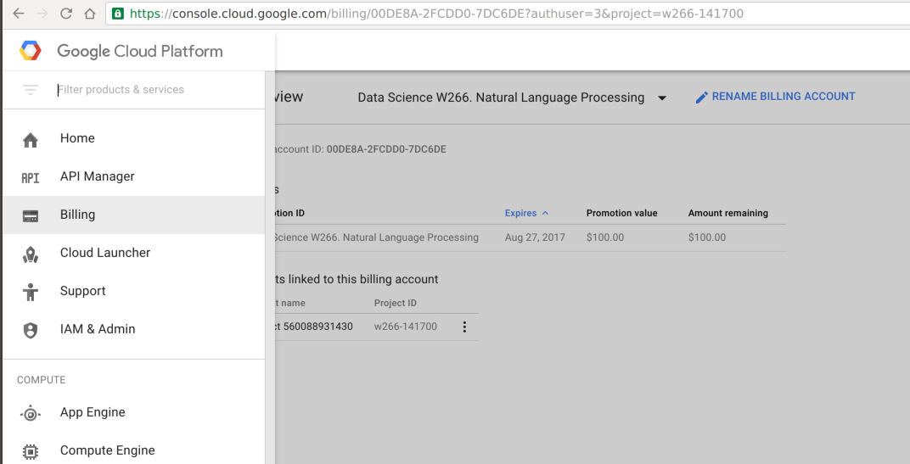
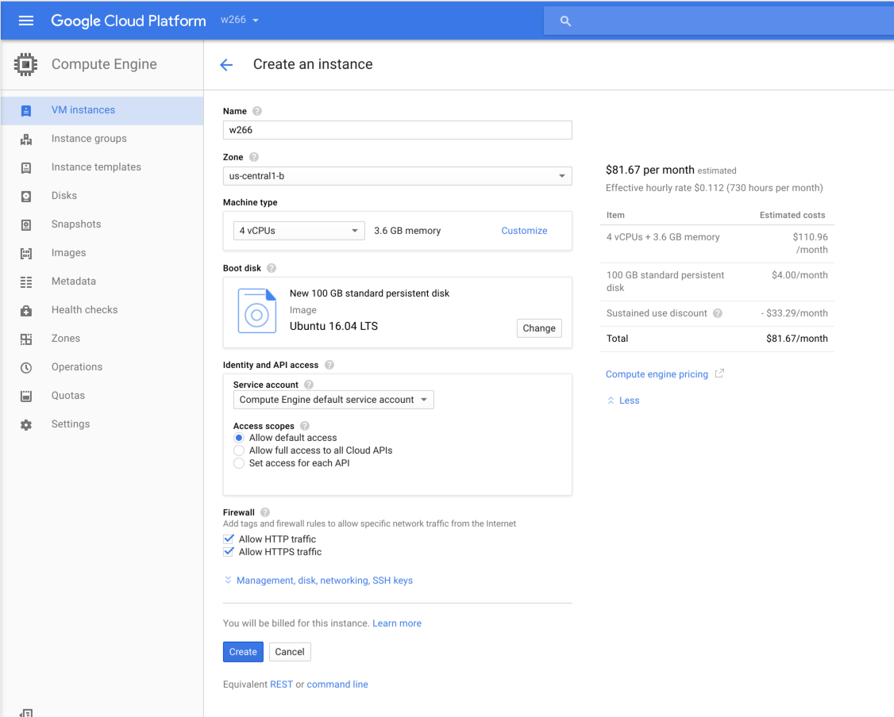
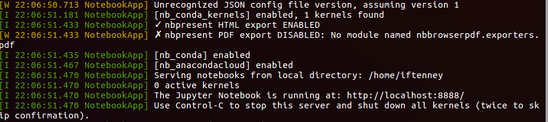
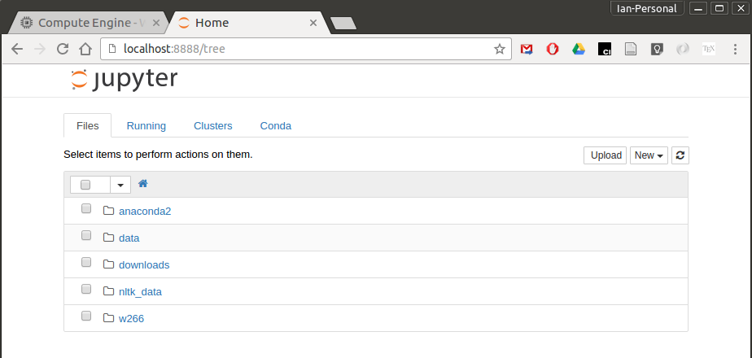
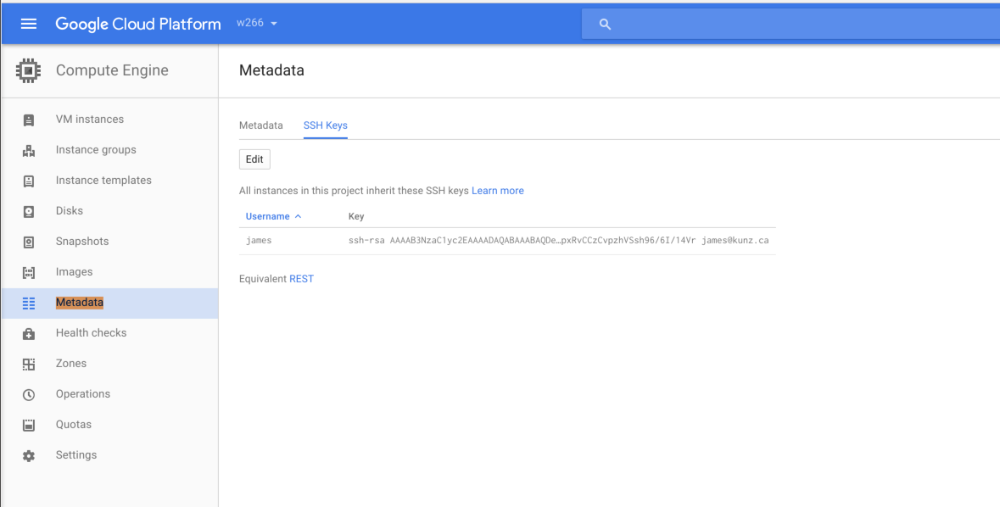
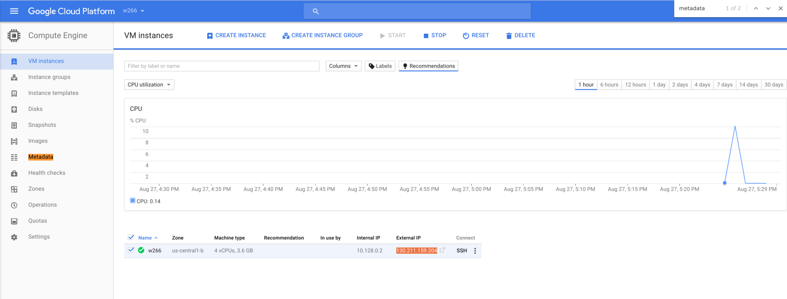

Cloud Instance Setup Instructions
=================================

Google has made $50.00 USD Compute Engine credits available to all of us.  There is some extra budget, but do not count on it.  Please **remember to shut down your instances** when you are done working.

Accounts, Projects and Billing
------------------------------

*  Make sure the **only** Google account you are currently logged in as is your [@berkeley.edu](http://bmail.berkeley.edu/) account.  
*  Visit [cloud.google.com](http://cloud.google.com)
*  Click "Console" in the upper right corner.



*  From the "Project" drop down menu, pick "Create project" and fill in the resulting form.




*  Create a new browser tab.
*  In the new tab, visit http://goo.gl/gcpedu/2trjU9 request a coupon, and follow the instructions.
*  Switch back to the original tab.
*  From the "hamburger" menu in the upper left corner, select Billing.



*  Verify the project is associated with your Compute Engine credits. You should see the course name in the Promotion ID field.

Start the Compute Engine instance
---------------------------------
*  From the hamburger menu again, select "Compute Engine"
*  (You may see a dialog box for a minute or two as Compute Engine initializes for your project.)
*  Click "Create Instance"
*  Fill in the instance creation form as shown below. Don't worry about the cost; the rate shown assumesalways-on, so you shouldn't come close to the limit if you shut down when not in use.



  * Name: w266
  * Zone: pick one close to you
  * Machine Type: 4 vCPUs, 3.6 GB
  * Boot Disk: Ubuntu 16.04 LTS (modify boot disk size to **100 GB**)
  * (Optionally) allow HTTP(s) traffic

*  Before clicking "Create", be absolutely sure that you have increased the disk space to at least 100 GB and have selected Ubuntu as your OS (the setup script that you'll run in a later step may not work otherwise).
*  Click "Create" at the bottom of the form.  You may need to wait a minute or two for your instance to boot.

The settings above (4 vCPU, 3.6 GB memory) should be more than sufficient for the assignments. If you need more juice for the project, you can either re-visit this step (and make a new instance), or select "Edit" from the VM Instances page to reconfigure an existing one.

Connecting to your instance
---------------------------
Google Cloud provides a handy in-browser SSH client. Click "SSH" on the VM Instances page, and it'll automatically handle setting up SSH keys. If you want to use your own terminal, see below.

Setting up your instance
------------------------
In your ssh terminal, type:
```
git clone https://github.com/datasci-w266/main.git ~/w266
cd w266/cloud
./setup.sh
```

`setup.sh` installs Anaconda and TensorFlow. There are a handful of times you'll need to accept the license agreement or confirm an install path (just accept the defaults, and allow it to modify your .bashrc file).

Run a notebook and connect to it from your local machine
--------------------------------------------------------
In order to use Jupyter notebooks, we need to set up an SSH tunnel. This will allow the browser on your local machine to connect directly to the Jupyter server and Python backend running on your cloud instance.

* First, install the Google Cloud SDK for your operating system. Follow the instructions at: https://cloud.google.com/sdk/
* If it gives you the option to run an `./install.sh` script or similar, do so.
* Run `gcloud init`. When prompted, select the W266 project you created. When it prompts you to set up Google Compute Engine, say yes, and enter the zone of your instance as the default (this should be `us-central1-b`).

* Run `gcloud compute ssh <instance_name>` to SSH to your instance. If it's your first time doing so, you'll be prompted to set up an SSH key. Enter a passphrase you won't forget!
* If you're able to log in successfully, hit Ctrl+D or type `logout` to exit.

* Run the following command, which will SSH to your server _and_ tunnel ports 8888 and 6006:
```
gcloud compute ssh --ssh-flag=”-L 8888:127.0.0.1:8888” --ssh-flag=”-L 6006:127.0.0.1:6006” <host-name>
```
That's a lot to type every time, so you might want to make a [shell alias](https://www.digitalocean.com/community/tutorials/an-introduction-to-useful-bash-aliases-and-functions) for it. Port 8888 is the default for Jupyter, and we'll be using port 6006 to access some monitoring interfaces for TensorFlow.

* If you're successfully logged in, start a Jupyter notebook server with `jupyter notebook`. You should see a message like "The Jupyter Notebook is running at: http://localhost:8888":


* Open a browser and go to http://localhost:8888. You should see the Jupyter notebook home:


You might want to use `tmux` (or `screen`) to keep the notebook server running, even if you get disconnected or want to leave something running while you close your terminal. On your instance, run:
````
tmux new-session -s notebook
# should see a new terminal prompt
jupyter notebook
````

* You can hit `Ctrl+b` then `d` to detach from the session, and type `tmux attach -t notebook` to re-attach.
* More on tmux: [A tmux Primer](https://danielmiessler.com/study/tmux/)


Shutting down your instance
---------------------------
**Don't forget to shut down your instance**, or you will quickly use up all your free credits.

* The easiest and safest way to shut down your instance is to type the following in the ssh session:
```
sudo shutdown now
```

Alternatively, you can force your instance down by:

* Return to the "VM instances" page
* Tick the box next to your instance
* Click "STOP" in the header

Restarting your instance
------------------------

Restarting your instance is as simple as:

* Return to the "VM instances" page
* Tick the box next to your instance
* Click "START" in the header


Using your own SSH client (advanced)
------------------------------------
If you don't want to use `gcloud compute ssh`, you can do the following to access your instance like any other server:

*  Once it boots, click on the three dots next to "ssh" and pick "Use another SSH client".
*  Follow the instructions on the linked page to create ssh keys and install them on your instance via the "Metadata" section.



*  Finish following the instructions to ssh to your instance.  Note for this step, you'll need your machine's External IP Address which can be found on the main VM Instances screen.



Note: you won't have to set up ssh keys every time you connect (you'll simply reuse the ones you just set up).

Now you can SSH normally. To SSH with port forwarding for Jupyter and TensorBoard, use:
```
ssh -L 8888:127.0.0.1:8888 -L 6006:127.0.0.1:6006 <instance_external_ip>
```
